“家新伴你行” E-Reading電子文章已經順利發行了!
=============================================
<!-- IF ENGLISH USE H5, OTHERWISE USE H4 -->

<a data-toggle="collapse" data-parent="#mag-panel" href="#collapse2014">2014</a>

  
<a href="../stayconnect_Jan_2014.pdf">

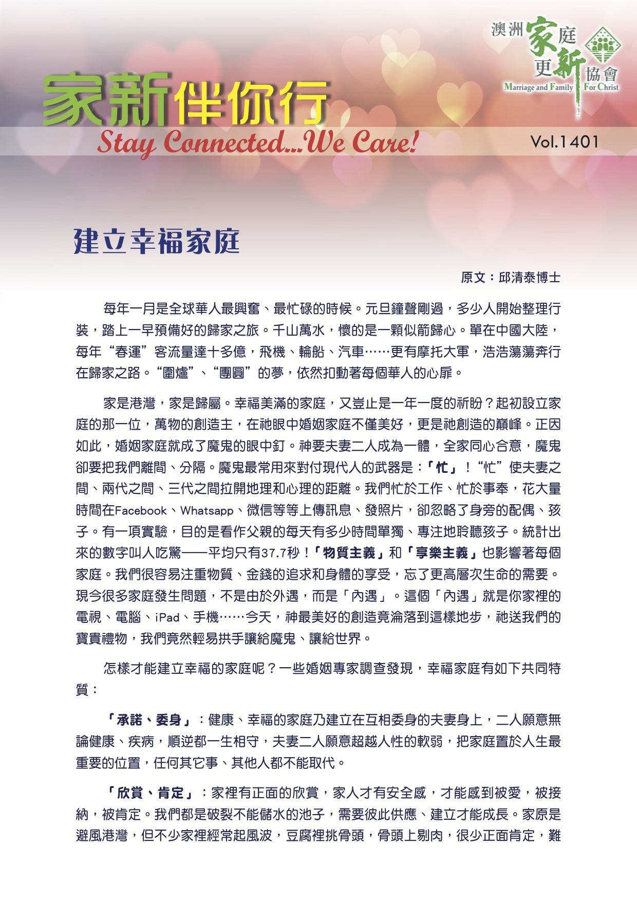

<h4>2014年1月號</h4>

</a>

 {{! End panel-body}}

 {{! End collapse}}

 {{! End panel}}

<a data-toggle="collapse" data-parent="#mag-panel" href="#collapse2013">2013</a>

  

<a href="../Mffc 1312.pdf">

<h4>2013年12月號</h4>

</a>
<a href="../English - December 2013.pdf">

<h4>2013 December Edition</h4>

</a>
<a href="../stayconnect_Sept_2013.pdf">

<h4>2013年9月號</h4>

</a>

<a href="../stayconnect_July_2013.pdf">

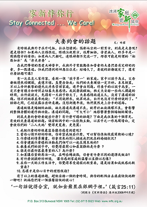

<h4>2013年7月號</h4>

</a>
<a href="../stayconnect_May_2013.pdf">

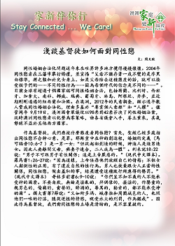

<h4>2013年5月號</h4>

</a>
<a href="../stayconnect_Apr_2013.pdf">

<h4>2013年4月號</h4>

</a>

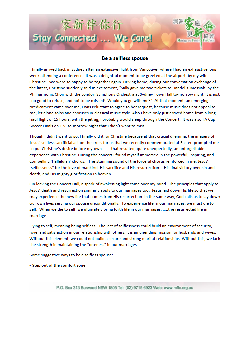

<h4>2013 April Edition</h4>

</a>
<a href="../stayconnect_Mar_2013.pdf">

<h4>2013年3月號</h4>

</a>
<a href="../stayconnect_Feb_2013.pdf">

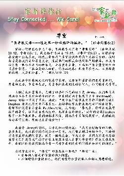

<h4>2013年2月號</h4>

</a>

<a href="../stayconnect_Feb_2013_en.pdf">

<h4>2013 Feburary Edition</h4>

</a>
<a href="../stayconnect_Jan_2013.pdf">

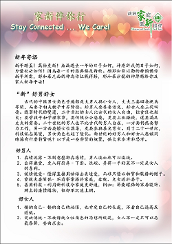

<h4>2013年1月號</h4>

</a>

{{! End panel-body }}

 {{! End collapse}}

 {{! End panel}}

<a data-toggle="collapse" data-parent="#mag-panel" href="#collapse2012">2012</a>

<a href="../stayconnect_Dec_2012.pdf">

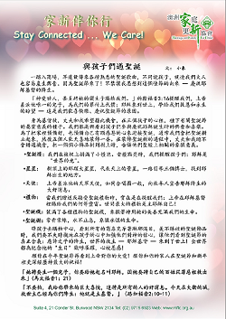

<h4>2012年12月號</h4>

</a>
<a href="../stayconnect_Dec_2012_en.pdf">

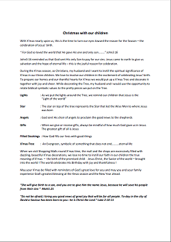

<h4>2012 December Edition</h4>

</a>

<a href="../stayconnect_Nov_2012.pdf">

<h4>2012年11月號</h4>

</a>
<a href="../stayconnect_Nov_2012_en.pdf">

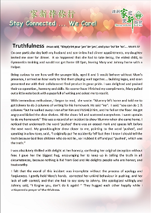

<h4>2012 November Edition</h4>

</a>

<a href="../English - September 2012.pdf">

 

<h4>2012 September Edition</h4>

</a>
<a href="../stayconnect_Sept_2012.pdf">

 

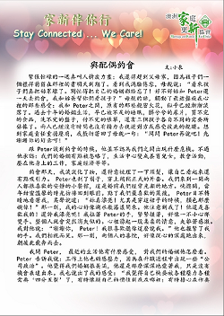

<h4>2012年9月號</h4>

</a>

<a href="../stayconnect_July_2012.pdf">

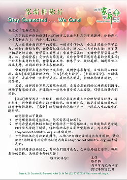

<h4>2012年7月號</h4>

</a>
<a href="../stayconnect_Aug_2012.pdf">

<h4>2012年8月號</h4>

</a>

 {{! End panel-body}}

 {{! End collapse}}

 {{! End panel}}

 {{! End Panel-group}}

