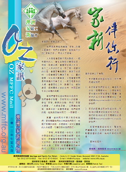
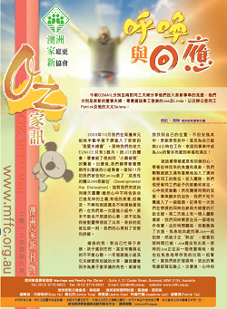

澳洲家新雜誌
========

澳訊 OZ MFFC Mail
-----------------

「家新季刊」及「澳洲家訊」過去一直藉文字工作堅固及勉勵信徒，受益者眾。  

有見現代閱讀模式普趨網絡化，「家新」於2013年開始推行電子閱讀計劃（E-Reading），以減省每年龐大印刷及郵寄費用，使資源能更有效投放於其他事工上；此舉亦能達致環保效益，減少浪費。  

在電子閱讀計劃下，「家新」將以電郵方式傳送總會出版之「家新季刊」及「澳洲家訊」，亦會按時發送「家新伴你行」（Stay
connected…We care）之分享文章。各刊物之電子版本亦能於家新網站下載。  

「家新」仍會印製印刷本，以供教會內傳閱。閣下如沒有特別要求索取印刷本，「家新」將自動以電子郵件方式送上刊物。為適切個人閱讀需要，如欲繼續收到印刷版本，「家新」仍然樂意定期免費郵寄府上，惟請填妥以下回條以便處理；如閣下願意以電郵收閱，或欲轉發與配偶分享，亦請填妥回條，我們便會定時發送。  

[按此下載回條 ](../E-magazine return slip 2014.pdf)

如欲更新個人資料，或確實郵寄及電郵地址無誤，請電郵 <info@mffc.org.au>
或致電本辦公室 (612) 97156923與我們聯絡。謝謝您對「家新」的支持。

_(本刊所有文章、照片及插圖均保留版權。未經本刊書面許可，不得以任何形式轉載及翻印。)_

<a data-toggle="collapse" data-parent="#mag-panel" href="#collapse2016">2016</a>

<a href="../Au_Newsletter_Mar2016.pdf">

<h3>2016年3月號</h3>

</a>

<a data-toggle="collapse" data-parent="#mag-panel" href="#collapse2015">2015</a>

<a href="../Au_Newsletter_Jul2015.pdf">

<h3>2015年7月號</h3>

</a>
<a href="../Au_Newsletter_Jan2015.pdf">

<h3>2015年1月號</h3>

</a>

<a data-toggle="collapse" data-parent="#mag-panel" href="#collapse2014">2014</a>

<a href="../Au_Newsletter_Jul2014.pdf">

<h3>2014年7月號</h3>

</a>
<a href="../Au_Newsletter_Jan2014.pdf">

<h3>2014年1月號</h3>

</a>

<a data-toggle="collapse" data-parent="#mag-panel" href="#collapse2013">2013</a>

<a href="../Au_Newsletter_Jun2013.pdf">

<h3>2013年6月號</h3>

</a>

<a data-toggle="collapse" data-parent="#mag-panel" href="#collapse2012">2012</a>

<a href="../Au_Newsletter_Oct2012.pdf">

<h3>2012年10月號</h3>

</a>
<a href="../Au_Newsletter_Jul2012.pdf">

<h3>2012年7月號</h3>

</a>
<a href="../Au_Newsletter_Apr2012.pdf">

<h3>2012年4月號</h3>

</a>
<a href="../Au_Newsletter_Jan2012.pdf">

<h3>2012年1月號</h3>

</a>

<a data-toggle="collapse" data-parent="#mag-panel" href="#collapse2011">2011</a>

<a href="../Au_Newsletter_Oct2011.pdf">

<h3>2011年10月號</h3>

</a>
<a href="../Au_Newsletter_Jul2011.pdf">

<h3>2011年7月號</h3>

</a>
<a href="../Au_Newsletter_Apr2011.pdf">

<h3>2011年4月號</h3>

</a>
<a href="../Au_Newsletter_Jan2011.pdf">

<h3>2011年1月號</h3>

</a>

　

　
