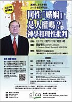

---
layout: page
title: 同性婚姻 與 澳洲聯邦選舉
lang: zh-hk
categories: 
  - ssm
--- 

同性婚姻 與 澳洲聯邦選舉
=======================
 
<h3>「同性婚姻立法」，不單違反聖經真理，亦對婚姻觀念、家庭結構、兒童成長、社會道德風氣、言論自由、宗教自由等有巨大而深遠影響。
請善用選票以反對「同性婚姻立法」。 </h3>
 
本網頁是資料庫，匯集有關同性婚姻的文章，給讀者參考。若讀者對文章內容有何疑問或建議，請直接與作者聯絡。
  

本網頁將會繼續加添文章，特別是有關政黨政策比較。請重返本網頁瀏覽。

  

<a data-toggle="collapse" data-parent="#mag-panel" href="#seminars"><h2>講座</h2></a>

  
	<a href="../SSM_Human_Rights.pdf">
	

	

	
	

	<h4>同性｢婚姻」是人權嗎？(2016年7月29，31日)</h4>
	

	

	</a>

 {{! End panel-body}}

 {{! End collapse}}

 {{! End panel}}

<a data-toggle="collapse" data-parent="#mag-panel" href="#articles"><h2>2016&nbsp;澳洲聯邦選舉</h2></a>

  
<ul>
<li>
	<a href="https://d3n8a8pro7vhmx.cloudfront.net/acl/pages/334/attachments/original/1466126908/ACL0616N_FINAL_Single.pdf">July 2: The Most Important Election In A Generation&nbsp;</a>
<li>
	<a href="../Major Parties value comparison.pdf">Major Parties Value Comparison&nbsp;</a>
<li>
	<a href="../Major Parties value comparison (SIM).pdf">政黨價值觀的比較&nbsp;</a>
<li>
	「華聯會」為2016年聯邦選舉發表聲明&nbsp;&nbsp;<a href="../SCCCA Public Statement for 2016 Election (TCM).pdf">(中文)</a>&nbsp;&nbsp;
	<a href="../SCCCA Public Statement for 2016 Election.pdf">(英文)</a>
<li>
	<a href="../SSM_and_Federal_Election.pdf">｢同性婚姻｣與2016澳洲聯邦選舉&nbsp;</a>
<li>
	<a href="../Your Important Vote.pdf">你舉足輕重的一票&nbsp;</a>
<li>
	如何使用選票反對「同性婚姻」立法&nbsp;&nbsp;<a href="../How_to_vote_against_SSM_(TCM).pdf">(繁體)</a>&nbsp;&nbsp;
	<a href="../How_to_vote_against_SSM_(SIM).pdf">(简体)</a>
<li>
	投票給誰&nbsp;&nbsp;<a href="../Whom_to_vote_for_(TCM).pdf">(繁體)</a>&nbsp;&nbsp;
	<a href="../Whom_to_vote_for_(TCM).pdf">(简体)</a>
<li>
	2016 年聯邦大選官方指南&nbsp;&nbsp;<a href="http://www.aec.gov.au/About_AEC/Translated_information/files/translated/chinese/official-guide-2016-chinese-traditional.pdf">(繁體)</a>&nbsp;&nbsp;
	<a href="http://www.aec.gov.au/About_AEC/Translated_information/files/translated/chinese/official-guide-2016-chinese-simplified.pdf">(简体)</a>
<li>
	<a href="../Major Party Logos.pdf">選票上的黨徽&nbsp;</a>
<li>
	投票指引
	  
	主要政黨在投票站外通常都會派發投票指引，例如<b>基督民主黨 (Christian Democratic Party) </b>的指引。你可以領取作參考，甚至跟隨指引，把數字填在選票上。
	  
	為了確保你的投票有效，請參閱AEC的說明&nbsp;
	<a href="http://www.aec.gov.au/About_AEC/Translated_information/files/translated/chinese/htv-chinese-traditional.pdf">(繁體)</a>&nbsp;&nbsp;
	<a href="http://www.aec.gov.au/About_AEC/Translated_information/files/translated/chinese/htv-chinese-simplified.pdf">(简体)</a>
	 
	以下是選票的樣本:
	  
	<table style="text-align: left; width: 100%;" border="1" cellpadding="5" cellspacing="0">
	<tbody>
		<tr>
			<td align="center"><b>眾議院</b></th>
			<td align="center"><b>參議院</b></th>
		</tr>
		<tr>
			<td align="center" valign="top">
				每一個空格都須填上，選票才有效。  
				
			</td>
			<td align="center" valign="top">
				在橫線上填寫至少6個空格，選票才有效。  
				
			</td>
		</tr>
	</tbody>
	</table>
</ul>

 {{! End panel-body}}

 {{! End collapse}}

 {{! End panel}}

<a data-toggle="collapse" data-parent="#mag-panel" href="#articles"><h2>文章</h2></a>

<ul>
<li>
	<a href="http://www.ctca.org.au/doc/newsletter32.pdf">如何用公共論據參與同性婚姻的辯論&nbsp;</a>
<li>
	<a href="../Same sex marriage Q&A  and implications.pdf">Same Sex Marriage Q&A and Implications&nbsp;</a>
<li>
	<a href="../SSM_QnA.pdf">同性婚姻問與答&nbsp;</a>
<li>
	<a href="../SSM_Discussion.pdf">同性婚姻討論&nbsp;</a>
<li>
	<a href="../Safe_Schools_Coalition.pdf">安全學校聯盟課程&nbsp;</a>
<li>
	<a href="../School_Education.pdf">當心子女在校教育&nbsp;</a>
<li>
	<a href="../Fight_For_Marriages.pdf">為傳統婚姻爭戰&nbsp;</a>
<li>
	<a href="../SSM_Damage_To_Society.pdf">同性婚姻合法化會對社會帶來的傷害&nbsp;</a>
<li>
	<a href="../SSM_Impact_On_Human_Rights.pdf">同性婚姻立法對人權的影響&nbsp;</a>
<li>
	<a href="../Origin_of_homosexuality.pdf">同性戀的起源：天生抑或後天&nbsp;</a>
<li>
	<a href="../SSM_Domino_Effects.pdf">同性婚姻立法的骨牌效應&nbsp;</a>
<li>
	<a href="../Euro_Human_Rights_Court.pdf">歐洲人權法院：同性婚姻不是人權&nbsp;</a>
<li>
	<a href="../European_Citizens_Initiative.pdf">歐洲各國發動聯署「父母與兒童」提案&nbsp;</a>
<li>
	<a href="../SSM_Canada.pdf">同性婚姻十年有成？ 加拿大的前車之鑑&nbsp;</a>
<li>
	<a href="../SSM_Massachusetts.pdf">同性婚姻對美國麻州的影響&nbsp;</a>
<li>
	<a href="../UNHRC.pdf">聯合國人權理事會決議：反對多元成家，鞏固傳統家庭&nbsp;</a>
</ul>

 {{! End panel-body}}

 {{! End collapse}}

 {{! End panel}}

<a data-toggle="collapse" data-parent="#mag-panel" href="#videos"><h2>視頻</h2></a>

  
<table style="text-align: left; width: 100%;" border="0"
 cellpadding="5" cellspacing="0">
  <tbody>
    <tr>
        <td>
            

            

            <blockquote cite="https://www.facebook.com/rd.sodo/videos/887534068032036/">
            
        </td>
    <tr>
        <td>
            

            

            <blockquote cite="https://www.facebook.com/rd.sodo/videos/896850750433701/">
            
        </td>
    </tr>
    <tr>
        <td>
			

			

			<blockquote cite="https://www.facebook.com/rd.sodo/videos/957833937668715/">
			
		</td>
    </tr>
  </tbody>
</table>

 {{! End panel-body}}

 {{! End collapse}}

 {{! End panel}}

 

<small>Authorised by Wing Hing Choi, MFFC, Suite 40, 11 Hunter Street, Parramatta NSW 2150</small>

