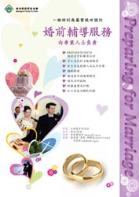

婚前評量及輔導服務
==================

<a href="../2011_Pre-marital_Counselling_Poster.jpg">

(放大)</a>

簡介 <a name="intro">&nbsp;</a>
-----
結婚是人生大事。從戀愛到談婚論嫁，情侶們都會思考到很多問題，例如對婚姻的期望，雙方的性格是否配合，婚後的財政處理，生育計劃……等等

澳洲家庭更新協會。多年來所舉辦的「恩愛夫婦營」更新了很多夫婦的關係。不但如此，「家新」更希望在情侶關係穩定期、結婚前、預備結婚之過程，以至結婚後等不同階段，提供全備的關顧和支持。因此「家新」推出「婚前評量及輔導服務」，由專業人仕帶領，透過專為婚前男女設計的〝PREPARE/ENRICH〞「婚前/
婚後評量及成長課程」，加上共三次的面談輔導，為準備結婚的男女做好婚前預備和調整。

此套婚前評量及輔導服務，並非取代教會牧者為將結婚人仕所進行的輔導。相反，此服務和教會牧者的婚前輔導是相輔相成，為準備結婚的男女作最充分的準備。
　
　
婚前/婚後評量及成長課程<a name="about">&nbsp;</a>
----------------------

PREPARE/ENRICH(婚前/婚後評量及成長課程)是美國Life Innovations Inc.
總裁Dr. David H.
Olson在80年代發展的一套可靠、有效並且使用簡便的婚前/婚後輔導和成長工具，能全面地評量情侶/夫妻關係，能藉此幫助二人了解彼此關係中的強項和待成長之處，並透過與輔導員的面談和實際練習，作有效溝通及處理分歧。目前此機構在全球共有13個辦事處，超過二百萬對情侶/夫婦做過這套評量課程。欲知該機構資料及有關測驗請參閱[www.prepare-enrich.com ](http://www.prepare-enrich.com)

內容: 

測驗：網上做PREPARE/ENRICH測驗問卷
(PREPARE/ENRICH於測驗後將分析報告寄回給「家新」)

面談: 輔導員根據分析報告，按其二人需要而分配面談重點

1. 因了解結合 – 認識二人關係中的強項和待成長之處
2. 最佳妙拍當 –角色與期望的互配
3. 表達與聆聽 – 良好溝通之鑰
4. 不打不相識 – 衝突的處理和化解
5. 不是同根生 – 明白原生家庭及其影響，姻親相處
6. 愛與性共攜 – 性生活的期望和配搭
7. 講錢增感情 – 理財藍圖的策劃
8. 携手闖明天 – 訂立未來個人、夫妻及家庭目標和計劃

每次面談時間: 60至90分鐘
服務語言: 粵語/國語

報名方法 <a name="register">&nbsp;</a>
--------
費用: 每對$296, 另支付PREPARE/ENRICH測驗問卷費用$44, 合共$340

[下載表格 ](../PreMaritalCounsellingApplicationForm.pdf) 

請下載表格，填妥後傳真至：(02) 9715 6924
或寄往家新辦事處

P.O. Box 587, Parramatta, NSW 2124 Australia

婚前輔導回顧及評量表

[下載表格 ](../Pre_Marital_Feedback_Form.pdf)

請下載表格，填妥後傳真至：(02) 9715 6924
或寄往家新辦事處

輔導員履歷<a name="profile">&nbsp;</a>
----------

<h3>悉尼</h3>

周天駇(Anselm Chow) 
<table style="text-align: left; width: 100%;" border="1"
 cellpadding="5" cellspacing="0">
  <tbody>
    <tr>
      <td style="width: 15%;">語言:</td>
      <td>普通話, 廣東話及英語</td>
    </tr>
    <tr>
      <td>性別:</td>
      <td>男</td>
    </tr>
    <tr>
      <td>專業會籍:</td>
      <td>美國心理輔導會專業會員 Professional member of American Counselling Association</td>
    </tr>
    <tr>
      <td colspan="1" rowspan="3">履歷:</td>
      <td>前香港浸會大學高級心理輔導主任 Former senior psychological counsellor, Hong Kong Baptist University</td>
    </tr>
    <tr>
      <td>前香港浸會大學持續進修學院輔導課程、香港伯特利神學院輔導課程客席講師 Former lecturer(part time) of counselling courses, Hong Kong Baptist University and Bethel Bible Seminary of Hong Kong</td>
    </tr>
    <tr>
      <td>前香港突破機構輔導中心、香港伯特利神學院輔導中心顧問 Former advisor of Breakthrough Counselling Center and Bethel Counselling Center, Hong Kong</td>
    </tr>
    <tr>
      <td>專長:</td>
      <td>婚姻輔導、婚前輔導、心理輔導及治療</td>
    </tr>
  </tbody>
</table>
 
葉小燕(Iris Yip) 
<table style="text-align: left; width: 100%;" border="1"
 cellpadding="5" cellspacing="0">
  <tbody>
    <tr>
      <td style="width: 15%;">語言:</td>
      <td>廣東話及英語</td>
    </tr>
    <tr>
      <td>性別:</td>
      <td>女</td>
    </tr>
    <tr>
      <td>專業會籍:</td>
      <td>新南威爾斯省輔導員及心理治療師專業協會會員 Member of Counsellors & Psychotherapists Association of NSW </td>
    </tr>
    <tr>
      <td>履歷:</td>
      <td>輔導學碩士, 浸信會神學院 Master of Counselling, Morling College</td>
    </tr>
    <tr>
      <td>專長:</td>
      <td>婚姻輔導、婚前輔導</td>
    </tr>
  </tbody>
</table>
 
梁于衡(Ben Leung) 
<table style="text-align: left; width: 100%;" border="1"
 cellpadding="5" cellspacing="0">
  <tbody>
    <tr>
      <td style="width: 15%;">語言:</td>
      <td>普通話, 廣東話及英語</td>
    </tr>
    <tr>
      <td>性別:</td>
      <td>男</td>
    </tr>
    <tr>
      <td colspan="1" rowspan="2">專業會籍:</td>
      <td>基督教輔導員專業協會會員Member of Christian Counsellors Association of Australia</td>
    </tr>
	<tr>
		<td>澳洲性教育人員,研究員及治療師專業協會會員Member of Australian Society of Sex Educators, Researchers and Therapists</td>
	</tr>
    <tr>
      <td>履歷:</td>
      <td>輔導學碩士, 浸信會神學院Master of Counselling, Morling College</td>
    </tr>
    <tr>
      <td>專長:</td>
      <td>婚姻輔導、夫妻性健康輔導</td>
    </tr>
  </tbody>
</table>

　

